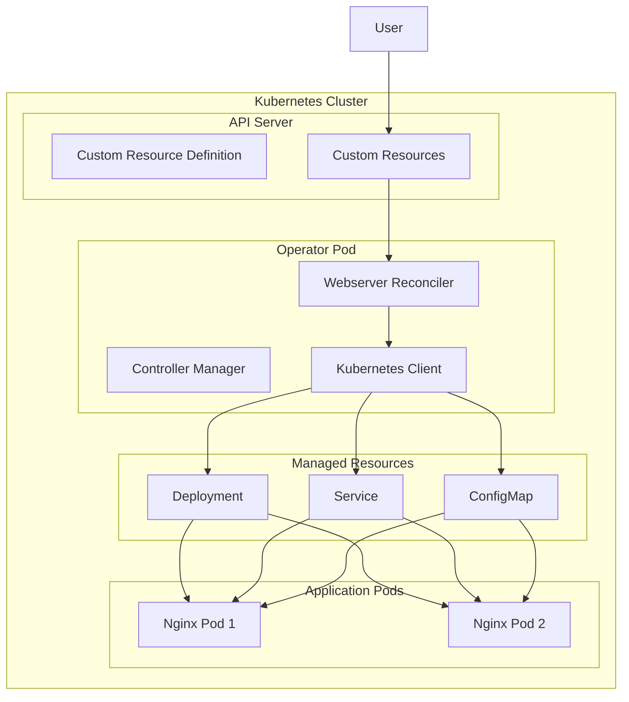
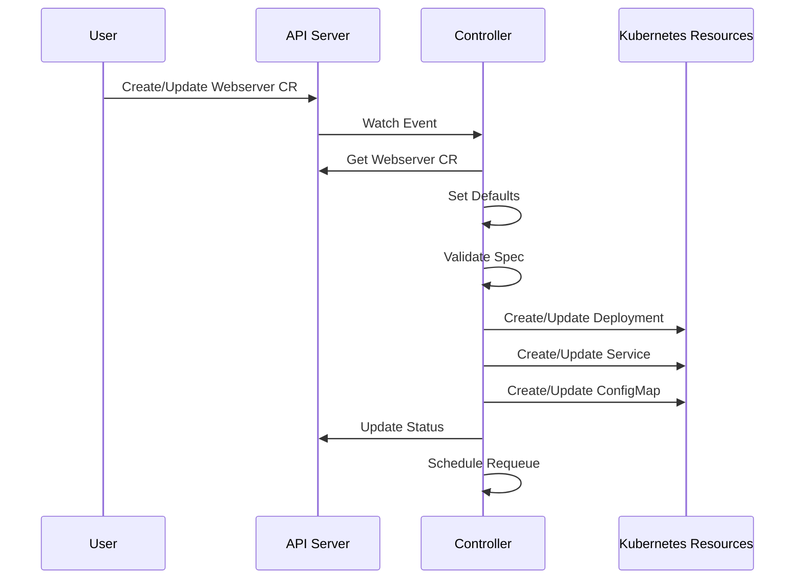
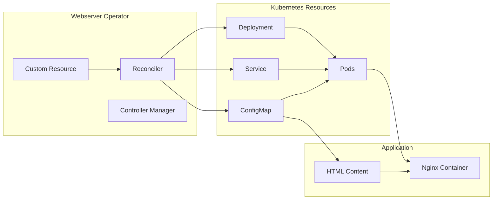

# Kubernetes Operator Development Guide

A comprehensive guide to building Kubernetes operators in Go using the controller-runtime framework. This project demonstrates best practices for creating production-ready operators with the Webserver Operator as a practical example.

## Table of Contents

1. [What is a Kubernetes Operator?](#what-is-a-kubernetes-operator)
2. [Operator Architecture Overview](#operator-architecture-overview)
3. [Project Structure](#project-structure)
4. [Core Components Deep Dive](#core-components-deep-dive)
5. [Development Workflow](#development-workflow)
6. [API Design and CRDs](#api-design-and-crds)
7. [Controller Implementation](#controller-implementation)
8. [Data Flow and Interactions](#data-flow-and-interactions)
9. [Testing Strategies](#testing-strategies)
10. [Deployment and Operations](#deployment-and-operations)
11. [Advanced Topics](#advanced-topics)
12. [Troubleshooting Guide](#troubleshooting-guide)
13. [Best Practices](#best-practices)

## What is a Kubernetes Operator?

A Kubernetes Operator is a method of packaging, deploying, and managing a Kubernetes application. It extends the Kubernetes API to create, configure, and manage instances of complex applications on behalf of a Kubernetes user.

### Key Concepts

- **Custom Resource Definition (CRD)**: Extends the Kubernetes API with new resource types
- **Controller**: A control loop that watches the state of your cluster and makes changes as needed
- **Reconciliation Loop**: The process of ensuring the actual state matches the desired state
- **Operator Pattern**: Encapsulates operational knowledge in software

### Why Use Operators?

1. **Automation**: Automate complex application lifecycle management
2. **Consistency**: Ensure consistent deployments across environments
3. **Self-Healing**: Automatically recover from failures
4. **Scaling**: Handle complex scaling scenarios
5. **Updates**: Manage rolling updates and rollbacks

## Operator Architecture Overview



The Webserver Operator provides a declarative way to deploy web servers on Kubernetes clusters. It creates and manages:

- Deployments for nginx web servers
- Services for exposing the web servers
- ConfigMaps with dynamic HTML content
- Status tracking and health monitoring
- Configuration management

## Features

- **Custom Resource Definition (CRD)**: Defines `Webserver` custom resources for web server management
- **Controller Logic**: Reconciles desired state with actual state
- **Dynamic Content**: Generates HTML content based on configuration
- **Status Management**: Tracks deployment status and conditions
- **Configuration**: Supports flexible web server configuration options
- **RBAC**: Proper role-based access control
- **Health Checks**: Built-in health and readiness probes
- **End-to-End Demo**: Complete working example with accessible web interface

## Project Structure

```
operator/
├── api/v1alpha1/                    # API definitions and CRD types
│   ├── groupversion_info.go        # API group and version info
│   ├── webserver_types.go          # Custom resource type definitions
│   └── zz_generated.deepcopy.go    # Generated deep copy methods
├── bin/                            # Build artifacts (generated, not committed)
│   ├── controller-gen              # Code generation tool (generated by make)
│   └── manager                     # Compiled operator binary (generated by make build)
├── config/                         # Kubernetes manifests
│   ├── crd/bases/                 # Custom Resource Definitions
│   │   └── webserver.io_webservers.yaml
│   ├── rbac/                      # Role-based access control
│   │   ├── role.yaml
│   │   ├── role_binding.yaml
│   │   └── service_account.yaml
│   ├── manager/                   # Manager deployment
│   │   └── manager.yaml
│   └── samples/                   # Sample CRD instances
│       └── webserver_v1alpha1_webserver.yaml
├── controllers/                    # Controller logic
│   └── webserver_controller.go    # Main reconciler implementation
├── hack/                          # Build and development scripts
│   └── boilerplate.go.txt         # License header template
├── main.go                        # Application entry point
├── Makefile                       # Build and deployment commands
├── go.mod                         # Go module dependencies
├── go.sum                         # Go module checksums
├── Dockerfile                     # Container image definition
├── cleanup.sh                     # Cleanup script
├── test-demo.sh                   # Demo script
└── README.md                      # This documentation
```

## Core Components Deep Dive

### 1. Custom Resource Definition (CRD)

The CRD defines the schema for our custom resource:

```yaml
apiVersion: apiextensions.k8s.io/v1
kind: CustomResourceDefinition
metadata:
  name: webservers.webserver.io
spec:
  group: webserver.io
  names:
    kind: Webserver
    plural: webservers
  scope: Namespaced
  versions:
  - name: v1alpha1
    schema:
      openAPIV3Schema:
        # Schema definition for validation
```

### 2. API Types

```go
// WebserverSpec defines the desired state
type WebserverSpec struct {
    Replicas    int32             `json:"replicas,omitempty"`
    Image       string            `json:"image,omitempty"`
    Port        int32             `json:"port,omitempty"`
    ServiceType string            `json:"serviceType,omitempty"`
    Config      WebserverConfig  `json:"config,omitempty"`
}

// WebserverStatus defines the observed state
type WebserverStatus struct {
    Conditions         []metav1.Condition `json:"conditions,omitempty"`
    ObservedGeneration int64              `json:"observedGeneration,omitempty"`
    ReadyReplicas      int32              `json:"readyReplicas,omitempty"`
    Phase              string             `json:"phase,omitempty"`
}
```

### 3. Controller Manager

The controller manager is the heart of the operator:

```go
func main() {
    // Setup scheme
    scheme := runtime.NewScheme()
    clientgoscheme.AddToScheme(scheme)
    webserverv1alpha1.AddToScheme(scheme)
    
    // Create manager
    mgr, err := ctrl.NewManager(ctrl.GetConfigOrDie(), ctrl.Options{
        Scheme:                 scheme,
        Metrics:                metricsserver.Options{BindAddress: ":8080"},
        HealthProbeBindAddress: ":8081",
        LeaderElection:         true,
        LeaderElectionID:       "f1c5ece8.webserver.io",
    })
    
    // Setup controller
    if err = (&controllers.WebserverReconciler{
        Client: mgr.GetClient(),
        Scheme: mgr.GetScheme(),
    }).SetupWithManager(mgr); err != nil {
        setupLog.Error(err, "unable to create controller")
        os.Exit(1)
    }
    
    // Start manager
    mgr.Start(ctrl.SetupSignalHandler())
}
```

### 4. Reconciler Implementation

The reconciler implements the core business logic:

```go
func (r *WebserverReconciler) Reconcile(ctx context.Context, req ctrl.Request) (ctrl.Result, error) {
    // 1. Fetch the custom resource
    webserver := &webserverv1alpha1.Webserver{}
    err := r.Get(ctx, req.NamespacedName, webserver)
    
    // 2. Set default values
    r.setDefaults(webserver)
    
    // 3. Create/update managed resources
    r.reconcileDeployment(ctx, webserver)
    r.reconcileService(ctx, webserver)
    r.reconcileConfigMap(ctx, webserver)
    
    // 4. Update status
    r.updateStatus(ctx, webserver)
    
    // 5. Schedule next reconciliation
    return ctrl.Result{RequeueAfter: time.Minute * 5}, nil
}
```

## Prerequisites

- Go 1.19 or later
- Kubernetes cluster (v1.19+)
- kubectl configured to access your cluster
- Docker (for building images)

## Setup and Binary Generation

The operator requires some binaries to be generated before use. These are not committed to the repository to keep it clean.

### Generate Required Binaries

```bash
# Generate controller-gen binary (for code generation)
make controller-gen

# Build the operator binary
make build

# Or generate all required tools at once
make manifests generate build
```

### What Gets Generated

- `bin/controller-gen` - Code generation tool for CRDs and RBAC
- `bin/manager` - The compiled operator binary
- `api/v1alpha1/zz_generated.deepcopy.go` - Generated deep copy methods
- `config/crd/bases/` - Generated CRD manifests
- `config/rbac/` - Generated RBAC manifests

## Development Workflow

### Step-by-Step Development Process

#### 1. Initialize the Project

```bash
# Create new operator project
kubebuilder init --domain webserver.io --repo github.com/webserver/webserver-operator

# Create API
kubebuilder create api --group webserver --version v1alpha1 --kind Webserver --resource --controller
```

#### 2. Define API Types

```go
// api/v1alpha1/webserver_types.go
type WebserverSpec struct {
    // Add your fields here
    Replicas int32 `json:"replicas,omitempty"`
    Image    string `json:"image,omitempty"`
    // ... more fields
}
```

#### 3. Generate Code

```bash
# Generate CRDs and RBAC
make manifests

# Generate deep copy methods
make generate
```

#### 4. Implement Controller Logic

```go
// controllers/webserver_controller.go
func (r *WebserverReconciler) Reconcile(ctx context.Context, req ctrl.Request) (ctrl.Result, error) {
    // Your reconciliation logic here
}
```

#### 5. Build and Test

```bash
# Build the operator
make build

# Run tests
make test

# Run locally
make run
```

#### 6. Deploy to Cluster

```bash
# Install CRDs
make install

# Deploy operator
make deploy

# Create sample resource
make create-sample
```

## Quick Start

### 1. Generate Required Binaries

```bash
# Generate all required tools and build the operator
make manifests generate build
```

### 2. Install CRDs

```bash
make install
```

### 3. Deploy the Operator

```bash
make deploy
```

### 4. Create a Sample Instance

```bash
make create-sample
```

### 5. Check Status

```bash
make status
```

### 6. Access the Web Server

```bash
# Get the service URL
kubectl get service webserver-sample-service

# If using LoadBalancer, get the external IP
kubectl get service webserver-sample-service -o jsonpath='{.status.loadBalancer.ingress[0].ip}'

# If using NodePort, get the node port
kubectl get service webserver-sample-service -o jsonpath='{.spec.ports[0].nodePort}'

# Port forward for local access
kubectl port-forward service/webserver-sample-service 8080:80
```

Then open your browser to `http://localhost:8080` to see the deployed web server!


## Data Flow and Interactions

### Resource Creation Flow



### Component Interactions



## Quick Demo

For a complete end-to-end demo, you can use the provided test script:

```bash
# Run the complete demo
./test-demo.sh

# Clean up when done
./cleanup.sh
```

This script will:
1. Build the operator
2. Install CRDs
3. Deploy the operator
4. Create a sample web server instance
5. Wait for everything to be ready
6. Show you how to access the web server

## What You'll See

When you access the web server, you'll see a beautiful, responsive web page that displays:

- **Custom Title and Message**: Configurable through the CRD spec
- **Dynamic Configuration**: Shows the current instance configuration
- **Real-time Information**: Displays instance name, namespace, replicas, image, port, and service type
- **Generation Timestamp**: Shows when the HTML content was generated
- **Status Indicator**: Confirms the web server is running successfully

The page is fully styled with CSS and demonstrates how the operator can generate dynamic content based on the custom resource configuration.

## Testing Strategies

### Unit Testing

```go
func TestWebserverReconciler_Reconcile(t *testing.T) {
    tests := []struct {
        name    string
        setup   func() *webserverv1alpha1.Webserver
        want    ctrl.Result
        wantErr bool
    }{
        {
            name: "successful reconciliation",
            setup: func() *webserverv1alpha1.Webserver {
                return &webserverv1alpha1.Webserver{
                    Spec: webserverv1alpha1.WebserverSpec{
                        Replicas: 2,
                        Image:    "nginx:1.25",
                    },
                }
            },
            want:    ctrl.Result{RequeueAfter: time.Minute * 5},
            wantErr: false,
        },
    }
    
    for _, tt := range tests {
        t.Run(tt.name, func(t *testing.T) {
            // Test implementation
        })
    }
}
```

### Integration Testing

```go
func TestWebserverIntegration(t *testing.T) {
    // Setup test environment
    env := &envtest.Environment{
        CRDDirectoryPaths: []string{filepath.Join("..", "config", "crd", "bases")},
    }
    
    cfg, err := env.Start()
    require.NoError(t, err)
    defer env.Stop()
    
    // Create test client
    k8sClient, err := client.New(cfg, client.Options{Scheme: scheme.Scheme})
    require.NoError(t, err)
    
    // Create test resource
    webserver := &webserverv1alpha1.Webserver{
        ObjectMeta: metav1.ObjectMeta{
            Name:      "test-webserver",
            Namespace: "default",
        },
        Spec: webserverv1alpha1.WebserverSpec{
            Replicas: 1,
            Image:    "nginx:1.25",
        },
    }
    
    err = k8sClient.Create(context.TODO(), webserver)
    require.NoError(t, err)
    
    // Verify resources are created
    // ... test assertions
}
```

### End-to-End Testing

```bash
#!/bin/bash
# test-demo.sh

echo "Running end-to-end test..."

# Install CRDs
make install

# Deploy operator
make deploy

# Wait for operator to be ready
kubectl wait --for=condition=available --timeout=300s deployment/controller-manager -n system

# Create sample resource
make create-sample

# Wait for resources to be ready
kubectl wait --for=condition=available --timeout=300s deployment/webserver-sample-deployment

# Test web server access
kubectl port-forward service/webserver-sample-service 8080:80 &
PF_PID=$!

sleep 5
curl -f http://localhost:8080 || exit 1

kill $PF_PID
echo "End-to-end test passed!"
```

## Development

### Building the Operator

```bash
# Build the binary
make build

# Run locally (for development)
make run
```

### Running Tests

```bash
make test
```

### Code Generation

```bash
# Generate CRDs and RBAC manifests
make manifests

# Generate deep copy methods
make generate
```

## Custom Resource Definition

The operator defines a `Webserver` custom resource with the following specification:

```yaml
apiVersion: webserver.io/v1alpha1
kind: Webserver
metadata:
  name: webserver-sample
  namespace: default
spec:
  replicas: 2                    # Number of replicas (1-10)
  image: nginx:1.25             # Container image (nginx web server)
  port: 80                      # Port the web server listens on
  serviceType: LoadBalancer     # Kubernetes service type
  config:
    title: "Webserver Operator Demo"  # Page title
    message: "Welcome to the Webserver Operator Demo!"  # Page message
    color: "#e3f2fd"            # Background color
    features:                   # Feature flags
      feature1: true
      feature2: false
```

### Status Fields

The operator updates the status with:

- `phase`: Current deployment phase (Reconciling, Ready, etc.)
- `readyReplicas`: Number of ready replicas
- `conditions`: Array of conditions describing the current state
- `observedGeneration`: Generation of the most recently observed resource

## API Reference

### WebserverSpec

| Field | Type | Description | Default |
|-------|------|-------------|---------|
| `replicas` | int32 | Number of desired replicas (1-10) | 1 |
| `image` | string | Container image to use | `nginx:1.25` |
| `port` | int32 | Port the web server listens on (1-65535) | 80 |
| `serviceType` | string | Kubernetes service type | `ClusterIP` |
| `config` | WebserverConfig | Configuration options | - |

### WebserverConfig

| Field | Type | Description | Default |
|-------|------|-------------|---------|
| `title` | string | Title displayed on the web page | "Webserver Operator Demo" |
| `message` | string | Message displayed on the web page | "Welcome to the Webserver Operator Demo!" |
| `color` | string | Background color of the web page | "#f0f0f0" |
| `features` | map[string]bool | Feature flags | {} |

### WebserverStatus

| Field | Type | Description |
|-------|------|-------------|
| `phase` | string | Current deployment phase |
| `readyReplicas` | int32 | Number of ready replicas |
| `conditions` | []Condition | Array of conditions |
| `observedGeneration` | int64 | Observed generation |

## Controller Logic

The controller implements the following reconciliation logic:

1. **Fetch**: Retrieve the Webserver custom resource
2. **Validate**: Set default values and validate the specification
3. **Reconcile**: Create or update associated Kubernetes resources:
   - ConfigMap with dynamic HTML content
   - Deployment for the nginx web server
   - Service for exposing the web server
4. **Status Update**: Update the status with current state information
5. **Requeue**: Schedule next reconciliation (every 5 minutes)

## Monitoring and Observability

The operator provides:

- **Metrics**: Prometheus metrics on port 8080
- **Health Checks**: Health and readiness probes on port 8081
- **Logging**: Structured logging with configurable levels
- **Status Conditions**: Kubernetes-native status reporting

## Advanced Topics

### Webhooks

#### Validation Webhook

```go
// +kubebuilder:webhook:path=/validate-webserver-io-v1alpha1-webserver,mutating=false,failurePolicy=fail,sideEffects=None,groups=webserver.io,resources=webservers,verbs=create;update,versions=v1alpha1,name=vwebserver.kb.io,admissionReviewVersions=v1

func (v *WebserverValidator) ValidateCreate(ctx context.Context, obj runtime.Object) error {
    webserver := obj.(*webserverv1alpha1.Webserver)
    
    // Validation logic
    if webserver.Spec.Replicas > 10 {
        return fmt.Errorf("replicas cannot exceed 10")
    }
    
    return nil
}
```

#### Mutation Webhook

```go
// +kubebuilder:webhook:path=/mutate-webserver-io-v1alpha1-webserver,mutating=true,failurePolicy=fail,sideEffects=None,groups=webserver.io,resources=webservers,verbs=create;update,versions=v1alpha1,name=mwebserver.kb.io,admissionReviewVersions=v1

func (m *WebserverMutator) Default(ctx context.Context, obj runtime.Object) error {
    webserver := obj.(*webserverv1alpha1.Webserver)
    
    // Set default values
    if webserver.Spec.Replicas == 0 {
        webserver.Spec.Replicas = 1
    }
    
    return nil
}
```

### Finalizers

```go
const webserverFinalizer = "webserver.io/finalizer"

func (r *WebserverReconciler) Reconcile(ctx context.Context, req ctrl.Request) (ctrl.Result, error) {
    webserver := &webserverv1alpha1.Webserver{}
    err := r.Get(ctx, req.NamespacedName, webserver)
    if err != nil {
        return ctrl.Result{}, err
    }
    
    // Check if resource is being deleted
    if webserver.DeletionTimestamp != nil {
        if controllerutil.ContainsFinalizer(webserver, webserverFinalizer) {
            // Perform cleanup
            if err := r.cleanupResources(ctx, webserver); err != nil {
                return ctrl.Result{}, err
            }
            
            // Remove finalizer
            controllerutil.RemoveFinalizer(webserver, webserverFinalizer)
            if err := r.Update(ctx, webserver); err != nil {
                return ctrl.Result{}, err
            }
        }
        return ctrl.Result{}, nil
    }
    
    // Add finalizer if not present
    if !controllerutil.ContainsFinalizer(webserver, webserverFinalizer) {
        controllerutil.AddFinalizer(webserver, webserverFinalizer)
        if err := r.Update(ctx, webserver); err != nil {
            return ctrl.Result{}, err
        }
    }
    
    // Normal reconciliation logic
    return r.reconcile(ctx, webserver)
}
```

### Custom Metrics

```go
import (
    "sigs.k8s.io/controller-runtime/pkg/metrics"
    "github.com/prometheus/client_golang/prometheus"
)

var (
    reconcileDuration = prometheus.NewHistogramVec(
        prometheus.HistogramOpts{
            Name: "webserver_reconcile_duration_seconds",
            Help: "Time spent reconciling Webserver resources",
            Buckets: prometheus.DefBuckets,
        },
        []string{"result"},
    )
)

func init() {
    metrics.Registry.MustRegister(reconcileDuration)
}

func (r *WebserverReconciler) Reconcile(ctx context.Context, req ctrl.Request) (ctrl.Result, error) {
    start := time.Now()
    defer func() {
        duration := time.Since(start).Seconds()
        reconcileDuration.WithLabelValues("success").Observe(duration)
    }()
    
    // Reconciliation logic
}
```

## Troubleshooting Guide

### Common Issues and Solutions

#### 1. CRD Not Found

**Problem**: `error: the server doesn't have a resource type "webservers"`

**Solution**:
```bash
# Install CRDs
make install

# Verify installation
kubectl get crd webservers.webserver.io
```

#### 2. Permission Denied

**Problem**: `error: webservers.webserver.io is forbidden: User "system:serviceaccount:system:controller-manager" cannot create resource "webservers"`

**Solution**:
```bash
# Check RBAC configuration
kubectl get clusterrole manager-role -o yaml

# Verify service account
kubectl get serviceaccount controller-manager -n system

# Check role binding
kubectl get clusterrolebinding manager-rolebinding
```

#### 3. Controller Not Starting

**Problem**: Controller pod is in CrashLoopBackOff

**Solution**:
```bash
# Check logs
kubectl logs -n system deployment/controller-manager

# Check events
kubectl describe pod -n system -l control-plane=controller-manager

# Common causes:
# - Missing CRDs
# - RBAC issues
# - Configuration errors
```

#### 4. Resources Not Created

**Problem**: Custom resource exists but managed resources are not created

**Solution**:
```bash
# Check controller logs
kubectl logs -n system deployment/controller-manager

# Verify resource status
kubectl describe webserver webserver-sample

# Check for errors in status conditions
kubectl get webserver webserver-sample -o yaml
```

### Debugging Techniques

#### 1. Enable Verbose Logging

```go
// In main.go
opts := zap.Options{
    Development: true,
    Level:       zapcore.DebugLevel,
}
```

#### 2. Add Debug Logging

```go
func (r *WebserverReconciler) Reconcile(ctx context.Context, req ctrl.Request) (ctrl.Result, error) {
    log := log.FromContext(ctx)
    log.V(1).Info("Starting reconciliation", "request", req)
    
    // Add debug information
    log.V(1).Info("Current state", 
        "webserver", webserver.Name,
        "generation", webserver.Generation,
        "spec", webserver.Spec)
}
```

#### 3. Check Resource Events

```bash
# Get events for specific resource
kubectl get events --field-selector involvedObject.name=webserver-sample

# Get all events in namespace
kubectl get events --sort-by=.metadata.creationTimestamp
```

### Check Operator Logs

```bash
make logs
```

### Verify CRD Installation

```bash
kubectl get crd webservers.webserver.io
```

### Check Resource Status

```bash
kubectl describe webserver webserver-sample
```

### Common Issues

1. **CRD not found**: Run `make install` to install the CRD
2. **Permission denied**: Ensure RBAC is properly configured
3. **Image pull errors**: Verify the image name and accessibility

## Best Practices

### 1. API Design

- **Use semantic versioning** for API versions
- **Provide sensible defaults** for all fields
- **Validate input** using OpenAPI schema
- **Include status subresource** for state reporting
- **Use conditions** for detailed status information

### 2. Controller Implementation

- **Handle errors gracefully** with appropriate requeue logic
- **Set owner references** for garbage collection
- **Use finalizers** for cleanup operations
- **Implement idempotent operations**
- **Add comprehensive logging**

### 3. Resource Management

- **Use labels and selectors** consistently
- **Implement proper RBAC** with least privilege
- **Set resource limits** and requests
- **Use health checks** for reliability
- **Implement graceful shutdown**

### 4. Testing

- **Write unit tests** for all business logic
- **Create integration tests** for end-to-end scenarios
- **Use table-driven tests** for multiple scenarios
- **Mock external dependencies**
- **Test error conditions**

### 5. Security

- **Use non-root containers**
- **Implement proper RBAC**
- **Scan container images** for vulnerabilities
- **Use secrets** for sensitive data
- **Enable admission webhooks** for validation

### 6. Monitoring

- **Expose metrics** for all operations
- **Use structured logging** with consistent format
- **Implement health checks**
- **Set up alerts** for critical conditions
- **Monitor resource usage**

### 7. Documentation

- **Document API changes** in release notes
- **Provide examples** for common use cases
- **Include troubleshooting guides**
- **Keep README updated**
- **Document configuration options**

## Quick Start Commands

```bash
# Complete setup and demo
make demo

# Individual steps
make manifests generate build  # Generate binaries and build operator
make install                   # Install CRDs
make deploy                    # Deploy operator
make create-sample             # Create sample resource
make status                    # Check status
make port-forward              # Access web server
make logs                      # View operator logs

# Development
make build                     # Build operator
make test                      # Run tests
make run                       # Run locally
make manifests                 # Generate manifests
make generate                  # Generate code

# Cleanup
make delete-sample             # Delete sample resource
make undeploy                  # Remove operator
make uninstall                 # Remove CRDs
```

## Contributing

1. Fork the repository
2. Create a feature branch
3. Make your changes
4. Run tests: `make test`
5. Submit a pull request

## License

This project is licensed under the Apache License 2.0.

## Interview Notes

This operator demonstrates several key concepts for Go/Kubernetes interviews:

### Go Concepts
- **Interfaces**: Using controller-runtime interfaces
- **Error Handling**: Proper error propagation and logging
- **Concurrency**: Context handling and goroutines
- **Testing**: Unit and integration test patterns

### Kubernetes Concepts
- **Custom Resources**: CRD definition and validation
- **Controllers**: Reconciliation loops and state management
- **RBAC**: Proper permission management
- **Status Management**: Conditions and status updates

### Best Practices
- **Resource Management**: Owner references and garbage collection
- **Configuration**: Default values and validation
- **Observability**: Logging, metrics, and health checks
- **Security**: RBAC and least privilege access

### Advanced Topics
- **Finalizers**: Resource cleanup on deletion
- **Webhooks**: Admission control and validation
- **Leader Election**: High availability patterns
- **Metrics**: Custom metrics and monitoring

## Conclusion

This guide provides a comprehensive overview of building Kubernetes operators in Go. The Webserver Operator serves as a practical example demonstrating:

- **API design** with CRDs and validation
- **Controller implementation** with reconciliation loops
- **Resource management** with proper lifecycle handling
- **Testing strategies** for reliable operators
- **Deployment practices** for production environments
- **Monitoring and observability** for operational excellence

By following these patterns and best practices, you can build robust, production-ready Kubernetes operators that automate complex application lifecycle management.

For more advanced topics and real-world examples, refer to the [Kubernetes Operator SDK documentation](https://sdk.operatorframework.io/) and the [controller-runtime documentation](https://pkg.go.dev/sigs.k8s.io/controller-runtime).
